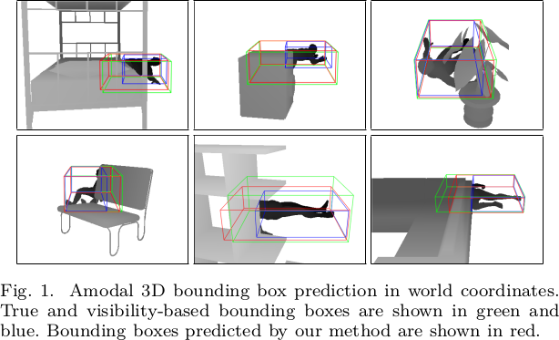

# Classification and Bounding Box Regression Nets

This repository contains material related to the paper "Multi-View Classification and 3D Bounding Box Regression Networks" by Pramerdorfer et al., ICPR 2018 (to appear). If you use this material, please cite this paper.

## Dataset

The dataset will be uploaded after the conference.

## Models

Trained models will be uploaded after the conference.

## Results

Qualitative regression results on test data:

